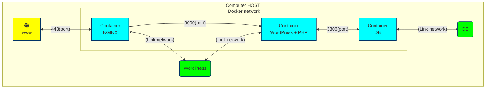
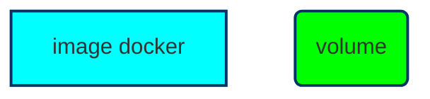

# Inception

**Inception is one of the [42](https://42tokyo.jp/) projects.**  
**It is a System Administration related exercise by using Docker.**

WordPress: https://toshota.42.fr/  
login: https://toshota.42.fr/wp-login.php

---
Architecture diagram:

